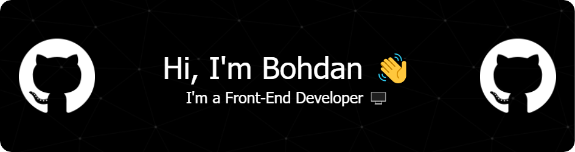

  </a>

I enjoy the whole process of developing creative websites and learning new things. I am always ready
for new challenges and look forward to meeting new people.

## 💼 Technical Skills

 

## 🔭 I'm currently working on

- My old projects
- My JavaScript skills

## 🌱 I'm currently learning

- English
- 

## 📈 GitHub Stats

### 🤝 Connect with me:

- 💬 If you have any question/feedback, please don't hesitate to contact me!
